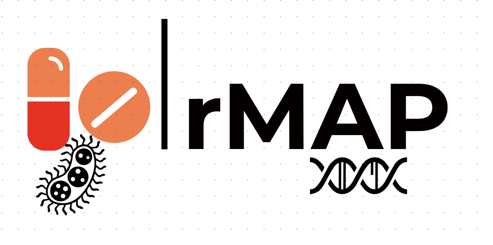

# GrandChallengesAfrica-AMR-Reports  

 

A repository containing comprehensive markdown _HTML_ reports generated using the Rapid Microbial Analysis Pipeline (rMAP) accessible via the [GitHub repository link](https://github.com/GunzIvan28/rMAP), [Publication Link](https://doi.org/10.1099/mgen.0.000583) or [PubMed ID](https://pubmed.ncbi.nlm.nih.gov/34110280/).

These reports were generated for Whole Genome Sequencing (WGS) data from a mother study titled _"UNDERSTANDING TRANSMISSION DYNAMICS AND ACQUISITION OF ANTIMICROBIAL RESISTANCE AT REFERRAL HOSPITALS AND COMMUNITY SETTINGS IN EAST AFRICA"_ isolated from from a World Health Organization pathogen watchlist, the **ESKAPE** (_Enterococcus faecium_, _Staphylococcus aureus,_ _Klebsiella pneumoniae_, _Acinetobacter baumannii_, _Pseudomonas aeruginosa_, and _Enterobacter_ species).